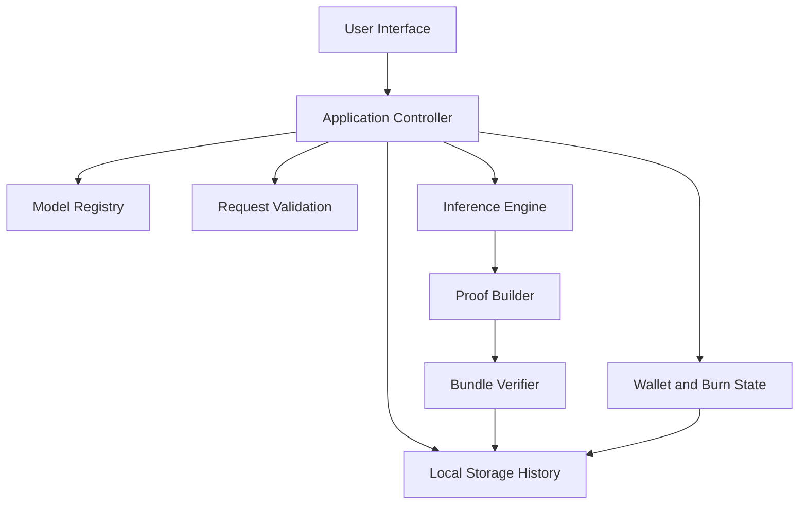

<p align="center">
  
</p>

<h1 align="center">SolProof AI MVP</h1>

<p align="center">
  A GitHub-ready static MVP for the <code>SolProof AI / PROOF</code> project.
</p>

<p align="center">
  This repository demonstrates a first-principles product baseline for verifiable AI on Solana:
  model selection, request validation, mock inference, proof bundle generation, local verification,
  token burn simulation, and replayable proof history.
</p>

<p align="center">
  <a href="https://proofaisol.xyz/">Official Website</a> |
  <a href="https://x.com/PROOF__SOL">Twitter</a> |
  <a href="https://github.com/fm374coullon/SolProof-AI.git">Repository</a>
</p>

## Table of Contents

- [Overview](#overview)
- [Project Goals](#project-goals)
- [Project Status](#project-status)
- [Core Features](#core-features)
- [Project Highlights](#project-highlights)
- [Official Links](#official-links)
- [Technical Architecture](#technical-architecture)
- [System Flow](#system-flow)
- [Functional Modules](#functional-modules)
- [Project Structure](#project-structure)
- [Technology Stack](#technology-stack)
- [Installation](#installation)
- [Usage](#usage)
- [Configuration](#configuration)
- [Verification Logic](#verification-logic)
- [Roadmap](#roadmap)
- [FAQ](#faq)
- [Current Limitations](#current-limitations)
- [Future Upgrades](#future-upgrades)
- [Notes](#notes)

## Overview

SolProof AI is positioned as a verifiable AI experience on Solana. This MVP is intentionally lightweight and static, but it captures the minimum product loop required to make the concept understandable and demo-ready:

1. A user selects a model
2. A user submits an input payload
3. The app performs a deterministic mock inference
4. The app creates a proof bundle from the request and output
5. The bundle is verified locally
6. The app stores a replayable receipt and burn history

The current version does **not** claim to provide production-grade zero-knowledge proofs or real on-chain verification. It is a clean MVP foundation designed for product validation, interface iteration, and future integration work.

## Project Goals

- Demonstrate the smallest believable SolProof product loop
- Make the "verifiable AI on Solana" concept tangible for demos and GitHub visitors
- Keep the repository simple enough to run without a build system
- Create clear seams for future wallet, API, proving, and chain integrations
- Preserve product credibility by validating proof bundles locally instead of only rendering static UI

## Project Status

| Area | Status | Notes |
|---|---|---|
| Product framing | Complete for MVP | Narrative, interface, and proof flow are visible |
| Static front-end | Complete for MVP | No bundler, no framework, GitHub-friendly |
| Model registry | Complete for MVP | Trial and Pro models are configurable |
| Request validation | Complete for MVP | Per-model validation rules are implemented |
| Mock inference engine | Complete for MVP | Deterministic heuristic outputs by model |
| Proof bundle generation | Complete for MVP | Fingerprints, commitment, proof hash, tx id |
| Local bundle verification | Complete for MVP | Rebuild and compare proof artifacts |
| Wallet simulation | Complete for MVP | Demo wallet and PROOF balance burn flow |
| On-chain verification | Planned | Not yet connected to Solana |
| Real AI integration | Planned | Not yet connected to an external model API |

## Core Features

- Trial and Pro model selection
- Prompt input with optional file metadata
- Per-model request validation rules
- Deterministic inference output generation
- Proof bundle construction with:
  - input fingerprint
  - output fingerprint
  - commitment
  - proof hash
  - public input hash
  - transaction id
- Local bundle verification and replay
- Demo wallet connection and PROOF token burn simulation
- Local storage persistence for history and active bundle state
- GitHub-friendly documentation and static deployment flow

## Project Highlights

- **Zero build tooling**
  - The app is static and easy to publish on GitHub Pages or any basic static host.

- **First-principles MVP design**
  - The implementation starts with the smallest trustworthy product loop instead of simulating a full protocol stack.

- **Replayable proof receipts**
  - History entries store complete bundles so previous runs can be reopened and re-verified.

- **Deterministic verification**
  - The verification layer rebuilds the bundle from the saved request and checks the critical proof fields.

- **Clear upgrade path**
  - The repository is structured so each subsystem can be replaced incrementally with real infrastructure.

## Official Links

| Resource | URL |
|---|---|
| Official Website | `https://proofaisol.xyz/` |
| Twitter | `https://x.com/PROOF__SOL` |
| GitHub Repository | `https://github.com/fm374coullon/SolProof-AI.git` |

## Technical Architecture

This MVP uses a static browser architecture with three main layers:

### 1. Presentation Layer

- HTML entry page
- CSS-based visual system
- Interactive UI rendered directly in the browser

### 2. Application Layer

- Model selection
- Form submission
- Request validation
- Wallet state
- Burn accounting
- History replay

### 3. Verification Layer

- Deterministic inference logic
- Request normalization
- Fingerprint generation
- Commitment and proof hash generation
- Local bundle reconstruction and verification

### Architecture Diagram



## System Flow


## Functional Modules

### Model Registry

Handles all model-facing configuration:

- model id
- display name
- tier
- burn amount
- constraints
- prompt hint
- validation minimums

### Inference Console

Provides the interactive request surface:

- prompt input
- optional file metadata
- quick-fill seeds
- run button
- execution mode feedback

### Verification Pipeline

Provides step-by-step visibility into the run:

- request intake
- inference execution
- commitment generation
- proof materialization
- local verification
- receipt archival

### Proof Artifact Panel

Displays the full result object:

- request envelope
- inference output
- fingerprints
- proof fields
- simulated receipt
- verification status

### Wallet and Burn State

Simulates token-gated access for Pro models:

- connect demo wallet
- initialize PROOF balance
- deduct burn amount
- show total burned

### History and Replay

Stores and reopens previous runs:

- summary list of recent runs
- replay previously generated bundles
- verify stored bundles again

## Project Structure

```text
.
|-- index.html
|-- styles.css
|-- app.js
|-- assets
|   `-- logo.png
|-- modules
|   |-- data.js
|   |-- engine.js
|   `-- state.js
`-- README.md
```

### File Responsibilities

| File | Responsibility |
|---|---|
| `index.html` | Main page layout and application entry |
| `styles.css` | Visual system, responsive layout, and component styling |
| `app.js` | UI orchestration, state updates, rendering, event wiring |
| `modules/data.js` | Model definitions, prompt seeds, and pipeline steps |
| `modules/engine.js` | Request normalization, inference logic, proof generation, verification |
| `modules/state.js` | Local storage loading, saving, and wallet identity helpers |
| `assets/logo.png` | Repository logo for GitHub and project branding |

## Technology Stack

### Runtime

- Browser-native JavaScript modules
- HTML5
- CSS3

### Browser APIs

- `Web Crypto API` for SHA-256 hashing
- `localStorage` for history persistence
- `Clipboard API` for copying bundles

### Hosting Model

- Static hosting
- GitHub Pages compatible
- No Node.js build pipeline required for runtime

## Installation

### Prerequisites

- A modern browser with ES module support
- Optional: a simple static file server for local preview

### Quick Start

1. Clone or download this repository.
2. Open the project folder.
3. Serve the folder with a static server.
4. Open the local URL in a browser.

### Local Preview Options

- VS Code Live Server
- Python:

```bash
python -m http.server 8000
```

- Any GitHub Pages-compatible static host

### Recommended Local URL

```text
http://localhost:8000
```

## Usage

### Basic Flow

1. Open the app in a browser
2. Select a model from the registry
3. Enter a prompt or use one of the seeded examples
4. Optionally attach a file for metadata-aware runs
5. Connect the demo wallet if using a Pro model
6. Click `Generate Proof`
7. Review the verification logs and proof artifact
8. Reopen a past run from history if needed

### Trial Model Flow

- No wallet required
- No token burn
- Best for demos and initial proof flow review

### Pro Model Flow

- Requires demo wallet connection
- Deducts a PROOF burn amount
- Produces the same proof flow plus burn accounting

## Configuration

This MVP is configured through plain JavaScript files.

### Model Configuration

Edit `modules/data.js` to change:

- model ids
- labels
- burn amounts
- constraints
- prompt hints
- validation minimums

### Prompt Seeds

Edit `PROMPT_SEEDS` in `modules/data.js` to change the quick-fill examples.

### Verification Steps

Edit `PIPELINE_STEPS` in `modules/data.js` to change log stage labels.

### Wallet and Storage Behavior

Edit `modules/state.js` to change:

- local storage key
- default state
- wallet address generation

### Inference and Proof Logic

Edit `modules/engine.js` to change:

- heuristic inference behavior
- fingerprint rules
- proof field construction
- verification comparison logic

## Verification Logic

The MVP verification system works by reconstructing the bundle from the saved request and comparing the rebuilt fields against the stored result.

### Verified Fields

- inference output
- input fingerprint
- output fingerprint
- commitment
- proof hash
- public input hash
- transaction id
- model identity
- configured burn amount

### Why This Matters

Even though the proof system is simulated, the MVP still enforces internal consistency. This makes the product demo more credible than a purely decorative interface.

## Roadmap

### April 2026 - Phase 1: MVP Foundation

- [x] Static repository structure
- [x] Model registry
- [x] Prompt submission
- [x] Deterministic inference logic
- [x] Proof bundle generation
- [x] Local verification
- [x] History replay
- [x] README and branding assets

### May 2026 - Phase 2: Product Hardening

- [ ] Add reset controls for wallet and history
- [ ] Add richer validation feedback in the UI
- [ ] Add export and import for receipts
- [ ] Add dedicated views for each model type

### June 2026 and Beyond - Phase 3: Real Integrations

- [ ] Connect wallet adapter
- [ ] Connect real AI inference endpoints
- [ ] Replace simulated proof generation with a real proving flow
- [ ] Add Solana transaction submission
- [ ] Add explorer-linked receipts from real network data

## FAQ

### Is this a real ZK proof implementation?

No. This repository is an MVP and uses deterministic simulated proof artifacts. It is designed to show the intended product loop, not to claim production-grade cryptographic security.

### Does this app talk to Solana right now?

No. The receipt and explorer link are simulated. The current version is chain-shaped, not chain-connected.

### Why use local verification if the proof is simulated?

Because local verification makes the bundle internally consistent and replayable. That helps communicate how a real verification system would behave.

### Why is there no build step?

The MVP is intentionally static so it can be published quickly and reviewed easily on GitHub or any simple static host.

### Where can I change model behavior?

Use `modules/data.js` for model configuration and `modules/engine.js` for inference and verification behavior.

### Why are Trial and Pro models both simulated?

The distinction is a product-gating concept in this MVP. Trial models are free, while Pro models require wallet connection and PROOF burn simulation.

## Current Limitations

- No real AI API integration
- No real Solana transaction signing or submission
- No server-side proving system
- No authentication or access control
- No backend persistence layer
- No automated test suite yet
- No package manifest because the runtime is static

## Future Upgrades

### Product Layer

- Add model-specific input templates
- Add visual proof receipt export
- Add richer error states and recovery flows

### AI Layer

- Replace heuristic inference with a model API
- Normalize structured output schemas across models
- Add request tracing and usage metering

### Verification Layer

- Integrate real proving infrastructure
- Add Solana receipt writing
- Add explorer-backed verification links
- Persist receipts to backend storage or indexing infrastructure

## Notes

- The visible model lineup in this MVP follows the models shown on the public SolProof site UI.
- The contract address remains unannounced in current public materials, so this demo intentionally treats CA as unavailable.
- The logo used in this repository is stored locally at `./assets/logo.png` so it renders correctly on GitHub.
- The repository currently focuses on product truthfulness and upgradeability over protocol completeness.
- Official project links used in this README:
  - Website: `https://proofaisol.xyz/`
  - Twitter: `https://x.com/PROOF__SOL`
  - Repository: `https://github.com/fm374coullon/SolProof-AI.git`
